flex是个非常好用的属性，如果说有什么可以完全代替 `float` 和 `position` ，那么肯定是非它莫属了（虽然现在还有很多不支持 flex 的浏览器）。然而在移动开发中，本来绝大多数浏览器（包括安卓2.3以上的自带浏览器）都支持的属性，偏偏有个例外，就是国产某某X5内核神器（不知哪个版本的webkit，仅支持 `display:box`），自主研发这东西也不好多说什么了，下面入正题。

首先还是从两个版本的语法开始讲吧，这里还是假设flex容器为 `.box` ，子元素为 `.item` 。

## 旧语法篇

### 定义容器的display属性

	.box{
		display: -moz-box; /*Firefox*/
		display: -webkit-box; /*Safari,Opera,Chrome*/
		display: box;
	}

### 容器属性

#### 1.box-pack属性

box-pack定义子元素主轴对齐方式。

	.box{
		-moz-box-pack: center; /*Firefox*/
		-webkit-box-pack: center; /*Safari,Opera,Chrome*/
		box-pack: center;
	}

box-pack属性总共有4个值：

	.box{
		box-pack: start | end | center | justify;
		/*主轴对齐：左对齐（默认） | 右对齐 | 居中对齐 | 左右对齐*/
	}

#### 2.box-align 属性

box-align定义子元素交叉轴对齐方式。

	.box{
		-moz-box-align: center; /*Firefox*/
		-webkit-box-align: center; /*Safari,Opera,Chrome*/
		box-align: center;
	}

box-align属性总共有5个值：

	.box{
		box-align: start | end | center | baseline | stretch;
		/*交叉轴对齐：顶部对齐（默认） | 底部对齐 | 居中对齐 | 文本基线对齐 | 上下对齐并铺满*/
	}

#### 3.box-direction 属性

box-direction定义子元素的显示方向。

	.box{
		-moz-box-direction: reverse; /*Firefox*/
		-webkit-box-direction: reverse; /*Safari,Opera,Chrome*/
		box-direction: reverse;
	}

box-direction属性总共有3个值：

	.box{
		box-direction: normal | reverse | inherit;
		/*显示方向：默认方向 | 反方向 | 继承子元素的 box-direction*/
	}

#### 4.box-orient 属性

box-orient定义子元素是否应水平或垂直排列。

	.box{
		-moz-box-orient: horizontal; /*Firefox*/
		-webkit-box-orient: horizontal; /*Safari,Opera,Chrome*/
		box-orient: horizontal;
	}

box-orient属性总共有5个值：

	.box{
		box-orient: horizontal | vertical | inline-axis | block-axis | inherit;
		/*排列方向：水平 | 垂直 | 行内方式排列（默认） | 块方式排列 | 继承父级的box-orient*/
	}

#### 5.box-lines 属性

box-lines定义当子元素超出了容器是否允许子元素换行。

	.box{
		-moz-box-lines: multiple; /*Firefox*/
		-webkit-box-lines: multiple; /*Safari,Opera,Chrome*/
		box-lines: multiple;
	}

box-lines属性总共有2个值：

	.box{
		box-lines: single | multiple;
		/*允许换行：不允许（默认） | 允许*/
	}

### 子元素属性

#### 1.box-flex 属性

box-flex定义是否允许当前子元素伸缩。

	.item{
		-moz-box-flex: 1.0; /*Firefox*/
		-webkit-box-flex: 1.0; /*Safari,Opera,Chrome*/
		box-flex: 1.0;
	}

box-flex属性使用一个浮点值：

	.item{
		box-flex: <value>;
		/*伸缩：<一个浮点数，默认为0.0，即表示不可伸缩，大于0的值可伸缩，柔性相对>*/
	}

#### 2.box-ordinal-group 属性

box-ordinal-group定义子元素的显示次序，数值越小越排前。

	.item{
		-moz-box-ordinal-group: 1; /*Firefox*/
		-webkit-box-ordinal-group: 1; /*Safari,Opera,Chrome*/
		box-ordinal-group: 1;
	}

box-direction属性使用一个整数值：

	.item{
		box-ordinal-group: <integer>;
		/*显示次序：<一个整数，默认为1，数值越小越排前>*/
	}

## 新版语法

### 定义容器的display属性

	.box{
		display: -webkit-flex; /*webkit*/
		display: flex;
	}
	
	/*行内flex*/
	.box{
		display: -webkit-inline-flex; /*webkit*/
		display:inline-flex;
	}

### 容器样式

	.box{
		flex-direction: row | row-reverse | column | column-reverse;
		/*主轴方向：左到右（默认） | 右到左 | 上到下 | 下到上*/
		
		flex-wrap: nowrap | wrap | wrap-reverse;
		/*换行：不换行（默认） | 换行 | 换行并第一行在下方*/
		
		flex-flow: <flex-direction> || <flex-wrap>;
		/*主轴方向和换行简写*/
		
		justify-content: flex-start | flex-end | center | space-between | space-around;
		/*主轴对齐方式：左对齐（默认） | 右对齐 | 居中对齐 | 两端对齐 | 平均分布*/
		
		align-items: flex-start | flex-end | center | baseline | stretch;
		/*交叉轴对齐方式：顶部对齐（默认） | 底部对齐 | 居中对齐 | 上下对齐并铺满 | 文本基线对齐*/
		
		align-content: flex-start | flex-end | center | space-between | space-around | stretch;
		/*多主轴对齐：顶部对齐（默认） | 底部对齐 | 居中对齐 | 上下对齐并铺满 | 上下平均分布*/
	}

**目前微信端不支持 `flex-wrap` 即flex的换行功能**

### 子元素属性

	.item{
		order: <integer>;
		/*排序：数值越小，越排前，默认为0*/
		
		flex-grow: <number>; /* default 0 */
		/*放大：默认0（即如果有剩余空间也不放大，值为1则放大，2是1的双倍大小，以此类推）*/
		
		flex-shrink: <number>; /* default 1 */
		/*缩小：默认1（如果空间不足则会缩小，值为0不缩小）*/
		
		flex-basis: <length> | auto; /* default auto */
		/*固定大小：默认为0，可以设置px值，也可以设置百分比大小*/
		
		flex: none | [ <'flex-grow'> <'flex-shrink'>? || <'flex-basis'> ]
		/*flex-grow, flex-shrink 和 flex-basis的简写，默认值为0 1 auto，*/
		
		align-self: auto | flex-start | flex-end | center | baseline | stretch;
		/*单独对齐方式：自动（默认） | 顶部对齐 | 底部对齐 | 居中对齐 | 上下对齐并铺满 | 文本基线对齐*/
	}

**目前微信端不支持 `flex:none|initial` 属性**

## 兼容写法

首先是定义容器的 display 属性：
	
	.box{
		display: -webkit-box; /* 老版本语法: Safari, iOS, Android browser, older WebKit browsers. */
		display: -moz-box; /* 老版本语法: Firefox (buggy) */
		display: -ms-flexbox; /* 混合版本语法: IE 10 */
		display: -webkit-flex; /* 新版本语法: Chrome 21+ */
		display: flex; /* 新版本语法: Opera 12.1, Firefox 22+ */
	}

由于旧版语法并没有列入W3C标准，所以这里不用写 display:box ，下面的语法也是一样的。

这里还要注意的是，如果子元素是行内元素，在很多情况下都要使用 display:block 或 display:inline-block 把行内子元素变成块元素（例如使用 box-flex 属性），这也是旧版语法和新版语法的区别之一。

### 子元素主轴对齐方式

	.box{
		-webkit-box-pack: center;
		-moz-justify-content: center;
		-webkit-justify-content: center;
		justify-content: center;
	}

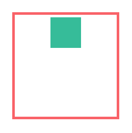

这里旧版语法有4个参数，而新版语法有5个参数，兼容写法新版语法的 space-around 是不可用的：

	.box{
		box-pack: start | end | center | justify;
		/*主轴对齐：左对齐（默认） | 右对齐 | 居中对齐 | 左右对齐*/
		
		justify-content: flex-start | flex-end | center | space-between | space-around;
		/*主轴对齐方式：左对齐（默认） | 右对齐 | 居中对齐 | 两端对齐 | 平均分布*/
	}

### 子元素交叉轴对齐方式

	.box{
		-webkit-box-align: center;
		-moz-align-items: center;
		-webkit-align-items: center;
		align-items: center;
	}
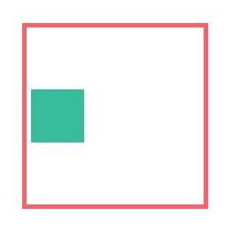

这里的参数除了写法不同，其实是功能是一样的：

	.box{
		box-align: start | end | center | baseline | stretch;
		/*交叉轴对齐：顶部对齐（默认） | 底部对齐 | 居中对齐 | 文本基线对齐 | 上下对齐并铺满*/
		
		align-items: flex-start | flex-end | center | baseline | stretch;
		/*交叉轴对齐方式：顶部对齐（默认） | 底部对齐 | 居中对齐 | 上下对齐并铺满 | 文本基线对齐*/
	}

### 子元素的显示方向

子元素的显示方向可通过 box-direction + box-orient + flex-direction 实现，下面请看实例：

**从左到右**

	.box{
		-webkit-box-direction: normal;
		-webkit-box-orient: horizontal;
		-moz-flex-direction: row;
		-webkit-flex-direction: row;
		flex-direction: row;
	}

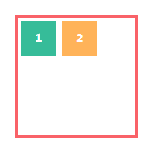

**右到左**

	.box{
		-webkit-box-pack: end;
		-webkit-box-direction: reverse;
		-webkit-box-orient: horizontal;
		-moz-flex-direction: row-reverse;
		-webkit-flex-direction: row-reverse;
		flex-direction: row-reverse;
	}

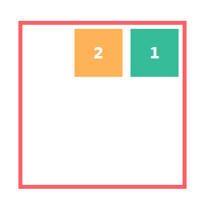

这里补充说明一点： box 写法的 box-direction 只是改变了子元素的排序，并没有改变对齐方式，需要新增一个 box-pack 来改变对齐方式。

**上到下**

	.box{
		-webkit-box-direction: normal;
		-webkit-box-orient: vertical;
		-moz-flex-direction: column;
		-webkit-flex-direction: column;
		flex-direction: column;
	}

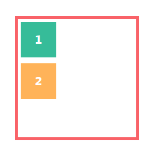

**下到上**

	.box{
		-webkit-box-pack: end;
		-webkit-box-direction: reverse;
		-webkit-box-orient: vertical;
		-moz-flex-direction: column-reverse;
		-webkit-flex-direction: column-reverse;
		flex-direction: column-reverse;
	}

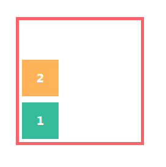

**是否允许子元素伸缩**

	.item{
		-webkit-box-flex: 1.0;
		-moz-flex-grow: 1;
		-webkit-flex-grow: 1;
		flex-grow: 1;
	}

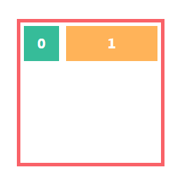
	
	.item{
		-webkit-box-flex: 1.0;
		-moz-flex-shrink: 1;
		-webkit-flex-shrink: 1;
		flex-shrink: 1;
	}

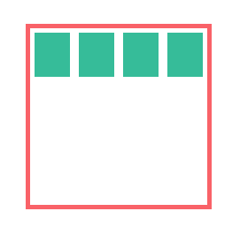

上面是允许放大，box语法中 `box-flex` 如果不是0就表示该子元素允许伸缩，而flex是分开的，上面 `flex-grow` 是允许放大（默认不允许），下面的 `flex-shrink` 是允许缩小（默认允许）。`box-flex` 默认值为0，也就是说，在默认的情况下，在两个浏览器中的表现是不一样的：

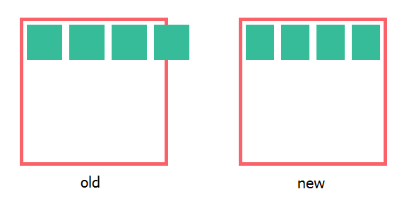 

而新版的语法中，放大的比例是直接按 flex-grow 的值来分配的，flex-grow 的缩放会覆盖 flex-shrink:0，看例子：

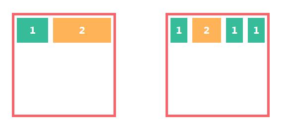 

参数：

	.item{
		box-flex: <value>;
		/*伸缩：<一个浮点数，默认为0.0，即表示不可伸缩，大于0的值可伸缩，柔性相对>*/
		
		flex-grow: <number>; /* default 0 */
		/*放大：默认0（即如果有剩余空间也不放大，值为1则放大，2是1的双倍大小，以此类推）*/
		
		flex-shrink: <number>; /* default 1 */
		/*缩小：默认1（如果空间不足则会缩小，值为0不缩小）*/
	}

### 子元素的显示次序

	.item{
		-webkit-box-ordinal-group: 1;
		-moz-order: 1;
		-webkit-order: 1;
		order: 1;
	}

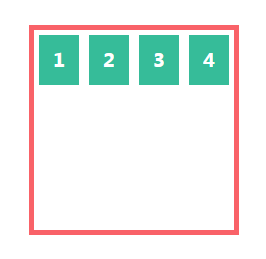 

最后总结，目前微信端对于flex的支持能实现一些简单的对齐布局，居中布局和多栏布局
